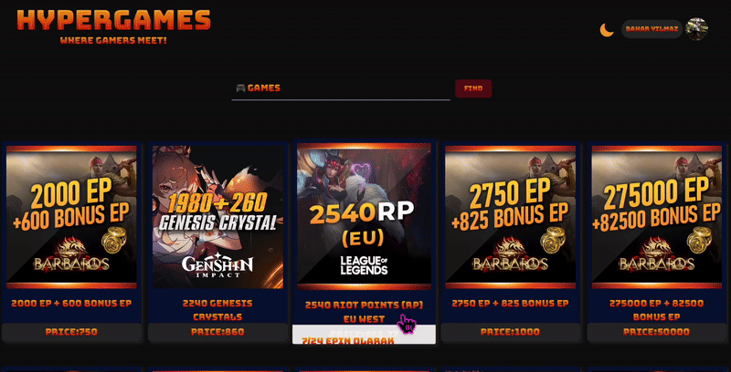

# 🎮 HYPERGAMES

### Where Gamers Meet!

HYPERGAMES is an online platform constructed with React, Tailwind CSS and Firebase. It allows gamers to buy video games, including both classic and new releases. The user can find the price and details of the games on this site with smooth and responsive user experience.

👉 **Live Demo:** [https://hyper-games.netlify.app/]

### Demo



### Features

🔐 User Authentication: Secure login and registration with Firebase Authentication.

🎮 Search Functionality: Quickly find games by title.

📱 Responsive Design: Fully responsive, optimized for mobile, tablet, and desktop views.

📄 Game Information: Detailed information about each game.

🌙 Light/Dark Mode: Switch between light and dark themes for a tailored experience.

🔔 Toasts for Alerts: Smooth and informative notifications with React-Toastify.

### Tech Stack

⚛️ React (with Vite): Fast and modern frontend development environment.

🎨 Tailwind CSS: A utility-first CSS framework for responsive and stylish designs.

🔥 Firebase: Provides authentication and data management.

📡 Axios:For making efficient API requests.

🖼️ Heroicons: Modern icons to enhance the user interface.

🔈 React-Toastify: User-friendly notifications.

🚀 pnpm: Fast, reliable, and efficient package management.

### Project Structure

```plaintext

    src
├── App.jsx
├── _redirects
├── assets
│   └── sounds
│       └── clickSound.mp3
├── auth
│   └── firebase.js
├── components
│   ├── ErrorBoundary.jsx
│   ├── atoms
│   │   ├── HoverButton.jsx
│   │   ├── Pagination.jsx
│   │   └── SwitchButton.jsx
│   ├── molecules
│   │   ├── DesktopMenu.jsx
│   │   └── MobileMenu.jsx
│   └── organisms
│       ├── Footer.jsx
│       ├── Navbar.jsx
│       └── ProductCard.jsx
├── context
│   ├── AuthContext.jsx
│   └── ProductContext.jsx
├── helpers
│   └── Toastify.js
├── index.css
├── main.jsx
├── pages
│   ├── Home.jsx
│   ├── Login.jsx
│   ├── NotFound.jsx
│   └── Register.jsx
└── router
    ├── AppRouter.jsx
    └── PrivateRouter.jsx
 ```

### Project Setup

If you'd like to run this project locally, follow these steps:

1. **Clone the Repository and Navigate to the Project Directory:**

   ```bash
   git clone https://github.com/zbaharyilmaz/hypergames.git

   cd hypergames
   ```

2. **Install Dependencies:**
   ```bash
   pnpm install
   ```
3. **Set up API**
- Create a .env file in your project root and add the following values.
   ```bash
   VITE_BASE_URL=https://your-api-base-url.com
   VITE_API_TOKEN=your_api_token
4. **Set up Firebase:**
- Go to Firebase Console, create a new project, and add a web app.
- Enable Authentication and choose Email/Password.
- Install Firebase:
- Add Firebase configuration values to .env file.

    ```bash
   VITE_API_KEY=your_firebase_api_key
   VITE_AUTH_DOMAIN=your_auth_domain.firebaseapp.com
   VITE_PROJECT_ID=your_project_id
   VITE_STORAGE_BUCKET=your_project_id.appspot.com
   VITE_MESSAGING_SENDER_ID=your_messaging_sender_id
   VITE_APP_ID=your_firebase_app_id
5. **Run the Development Server:**

   ```bash
    pnpm dev
   ```

6. **Open the App:**

- Visit http://localhost:3000 in your browser to view the app.

###  Future Enhancements

- Payment Integration: Put in place a safe payment gateway so that users can buy games straight from the platform.

- User Profiles: Let users make personal profiles so they may keep track of their past purchases, wishlists, and games they've bought.

- Game Reviews and Ratings: Provide a community-driven feedback system by allowing users to score and review games.

### Contributing

Feel free to fork the repo and submit PRs for improvements!
